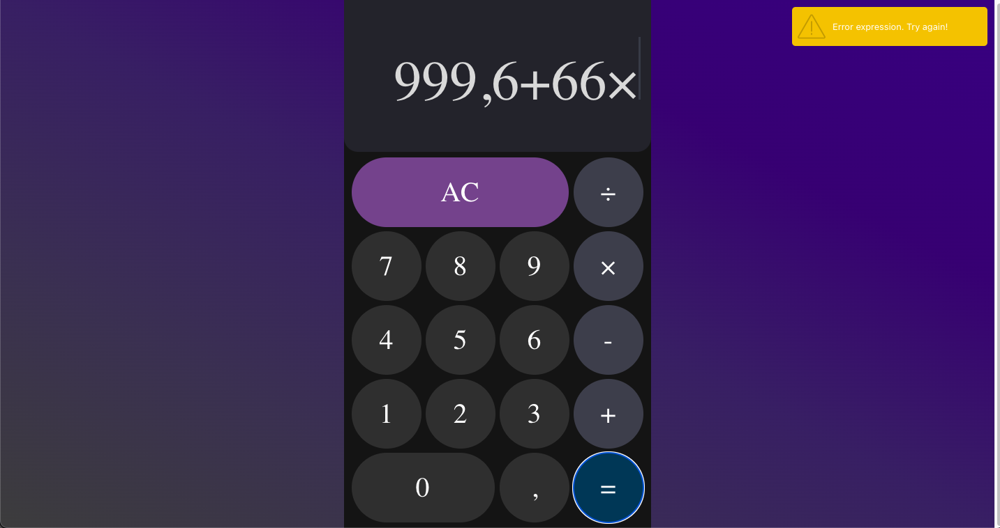
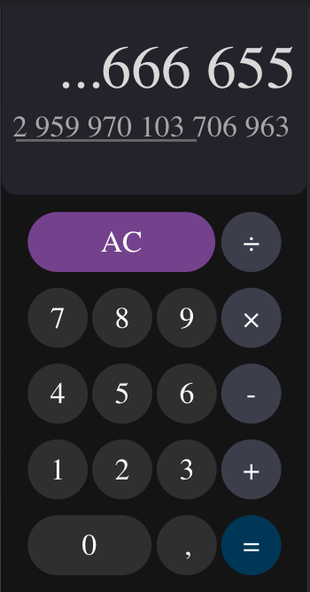

1. This project is implemented using Webpack and configured for GitHub Pages. To
   run the project locally, first install all dependencies by running the
   command "npm i" in the terminal. If all dependencies are installed
   successfully, start the project with "npm start."

2. The application supports keyboard input. When using the keyboard, an animated
   cursor appears on the screen. You can perform mathematical operations,
   including division, multiplication, addition, subtraction, and calculation.

3. In case of incorrect input, the user will be shown a notification with the
   text "Error in the expression. Please try again!" This means that a specific
   error occurred during input, and it is recommended to try again.
   

4. To perform multiplication using the keyboard, use the 'X' key, also known as
   'Ч'. It doesn't matter in which language the key is used; multiplication will
   work. This feature is designed for convenience, especially if the user
   forgets to switch the keyboard layout. To obtain the result using the
   keyboard, you need to press "=", and you can input a comma as usual.
   Additionally, you can input a comma using the Shift + 6 key combination or
   the ENG key followed by "<". The division key is "/". To clear the result,
   press "Backspace".

5. Keyboard focus indicators have been added to the styles so that users can see
   which keys they are pressing. 

6. Responsive design is present, which changes the appearance of the calculator
   when transitioning to a larger screen.

7. Vercel link:
   Gh-pages link:

8. If the user receives a long response, they can scroll to view it in its
   entirety.  sdsdsd kjss ывыв kdfmdk
